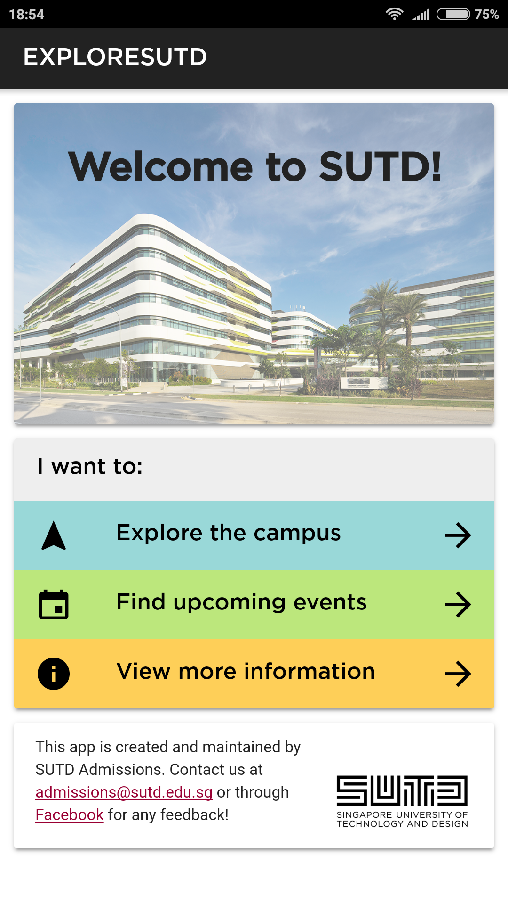
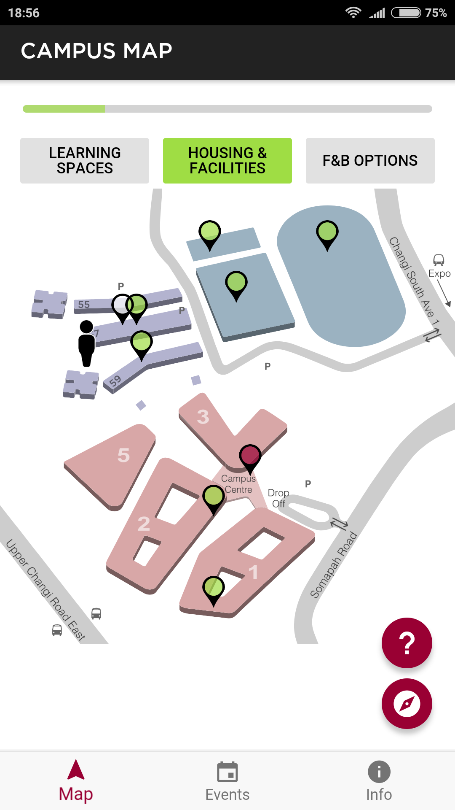
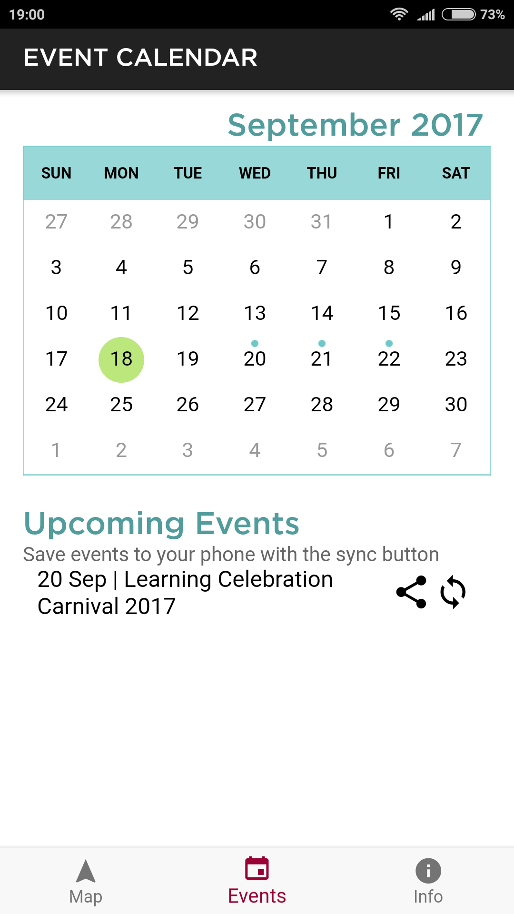
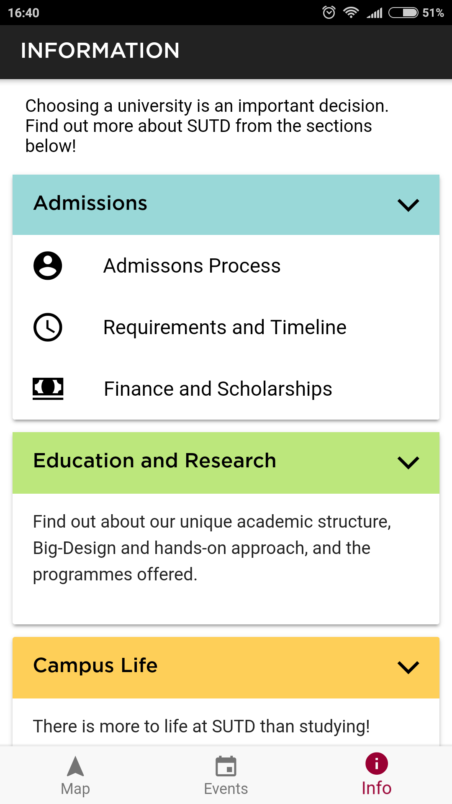

exploreSUTD is the official mobile application of the Singapore University of Technology and Design.

I worked with two other students to conceptualize and develop this app for my university's admissions office. We pitched the idea of an app that would not only be informative for prospective students, but also have interactive elements. A main focus would be to showcase the unique culture of our school. This landed us a contract to develop and maintain the app, with potential for new features to be added.

The three main components of the app are a campus map, event calendar and information for applicants:

  
  
  
  

- Built with [Ionic](https://ionicframework.com/), an AngularJS framework for creating cross-platform applications
- Incorporates Google Analytics to track the usage of the app
- Dynamic content from various RSS feeds (eg. news, student blogs)
- Custom online Content Management System built with Rails

exploreSUTD is currently in use and available for both [iOS](https://itunes.apple.com/sg/app/exploresutd/id1208872794?mt=8) and [Android](https://play.google.com/store/apps/details?id=com.ionicframework.exploreSUTD&hl=en).
