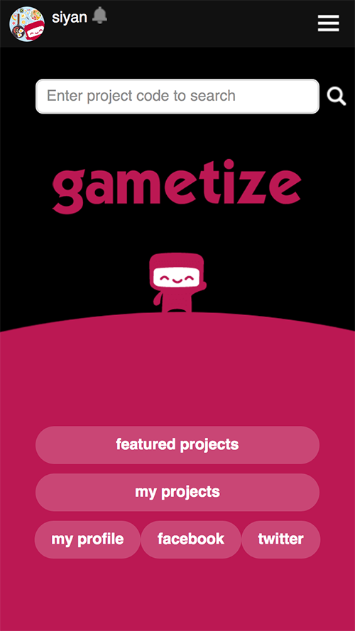
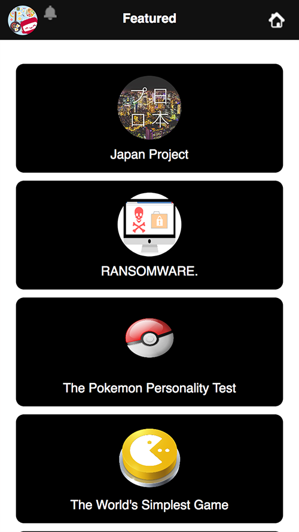
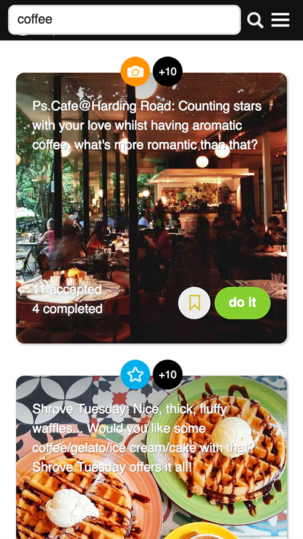
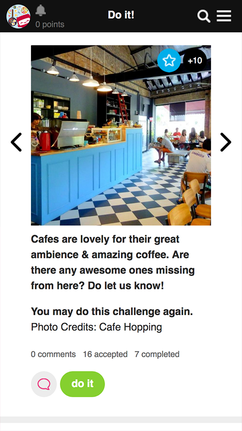
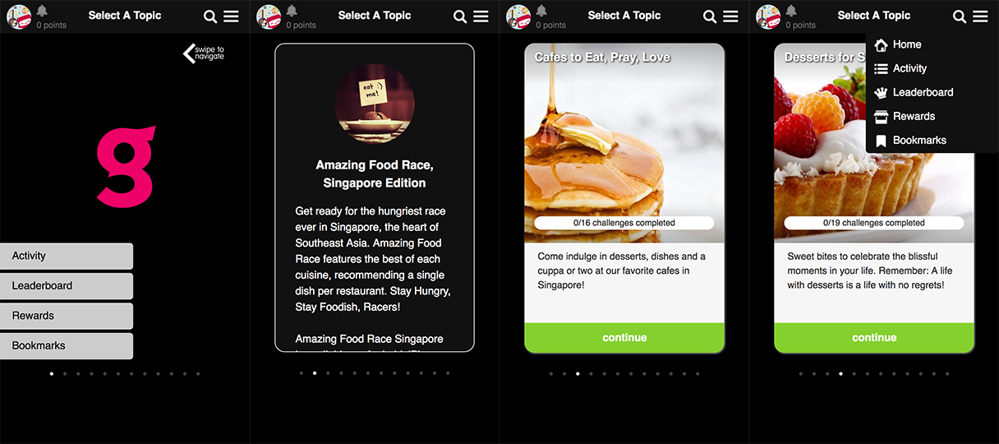
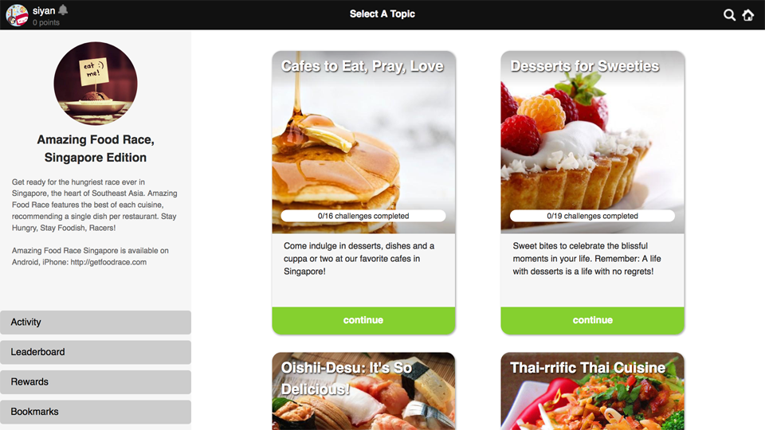

As a Technology Development Intern at Gametize, I redeveloped the company's customer-facing web platform.

_[Gametize](https://gametize.com/index) is a gamification software and consulting company that focuses on using game psychology to increase user engagement. On the Gametize platform, users can complete various kinds of challenges to earn points, badges and rewards._

I was tasked to redevelop the the player web platform using a front-end web framework, in order to improve the speed of the website and align the user interface (UI) with the existing mobile applications. Together with another intern, I completed the redesign and development of the platform within the 4-month internship.

Some of the different screens in the site:

  
  
  
  

 
Mobile carousell and drop-down menu, following the style of the Gametize mobile apps:

 
Layout with a sidebar for big screens:

- Built with [React](https://facebook.github.io/react/), a JavaScript library for creating UIs
- Content is fetched and posted through API calls, making the site very lean and fast
- Was involved in entire software development process, from assessing requirements to building and testing
- Designed UI to be modern, intuitive and mobile-responsive

This new player platform is being used in a client project.